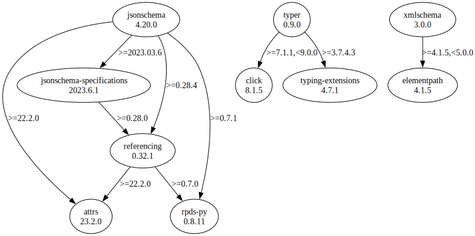

# Third Party Dependencies

<!--[[[fill sbom_sha256()]]]-->
The [SBOM in CycloneDX v1.4 JSON format](https://github.com/sthagen/pilli/blob/default/sbom.json) with SHA256 checksum ([b4b65458 ...](https://raw.githubusercontent.com/sthagen/pilli/default/sbom.json.sha256 "sha256:b4b65458191c294b354e61e27f0c94f582499209114ccf22272ca2d7124385a4")).
<!--[[[end]]] (checksum: d90e73ab58ba24404473be8b3570eb81)-->
## Licenses

JSON files with complete license info of: [direct dependencies](direct-dependency-licenses.json) | [all dependencies](all-dependency-licenses.json)

### Direct Dependencies

<!--[[[fill direct_dependencies_table()]]]-->
| Name                                                                               | Version                                               | License     | Author            | Description (from packaging data)                                  |
|:-----------------------------------------------------------------------------------|:------------------------------------------------------|:------------|:------------------|:-------------------------------------------------------------------|
| [jsonschema](https://github.com/python-jsonschema/jsonschema/blob/main/README.rst) | [4.17.3](https://pypi.org/project/jsonschema/4.17.3/) | MIT License | Julian Berman     | An implementation of JSON Schema validation for Python             |
| [typer](https://github.com/tiangolo/typer)                                         | [0.7.0](https://pypi.org/project/typer/0.7.0/)        | MIT License | Sebastián Ramírez | Typer, build great CLIs. Easy to code. Based on Python type hints. |
| [xmlschema](https://github.com/sissaschool/xmlschema)                              | [2.1.1](https://pypi.org/project/xmlschema/2.1.1/)    | MIT License | Davide Brunato    | An XML Schema validator and decoder                                |
<!--[[[end]]] (checksum: 945ef469e3f4e9ee7631645a3f5d32a1)-->

### Indirect Dependencies

<!--[[[fill indirect_dependencies_table()]]]-->
| Name                                                      | Version                                               | License     | Author            | Description (from packaging data)                                |
|:----------------------------------------------------------|:------------------------------------------------------|:------------|:------------------|:-----------------------------------------------------------------|
| [attrs](https://www.attrs.org/)                           | [22.2.0](https://pypi.org/project/attrs/22.2.0/)      | MIT License | Hynek Schlawack   | Classes Without Boilerplate                                      |
| [click](https://palletsprojects.com/p/click/)             | [8.1.3](https://pypi.org/project/click/8.1.3/)        | BSD License | Armin Ronacher    | Composable command line interface toolkit                        |
| [elementpath](https://github.com/sissaschool/elementpath) | [3.0.2](https://pypi.org/project/elementpath/3.0.2/)  | MIT License | Davide Brunato    | XPath 1.0/2.0/3.0 parsers and selectors for ElementTree and lxml |
| [pyrsistent](https://github.com/tobgu/pyrsistent/)        | [0.19.2](https://pypi.org/project/pyrsistent/0.19.2/) | MIT License | Tobias Gustafsson | Persistent/Functional/Immutable data structures                  |
<!--[[[end]]] (checksum: 77cd0eb0f29b7c2f11c5448300df736c)-->

## Dependency Tree(s)

JSON file with the complete package dependency tree info of: [the full dependency tree](package-dependency-tree.json)

### Rendered SVG

Base graphviz file in dot format: [Trees of the direct dependencies](package-dependency-tree.dot.txt)



### Console Representation

<!--[[[fill dependency_tree_console_text()]]]-->
````console
jsonschema==4.17.3
  - attrs [required: >=17.4.0, installed: 22.2.0]
  - pyrsistent [required: >=0.14.0,!=0.17.2,!=0.17.1,!=0.17.0, installed: 0.19.2]
typer==0.7.0
  - click [required: >=7.1.1,<9.0.0, installed: 8.1.3]
xmlschema==2.1.1
  - elementpath [required: >=3.0.0,<4.0.0, installed: 3.0.2]
````
<!--[[[end]]] (checksum: 679d08a1a281ff630fe95e14adce4bfc)-->
